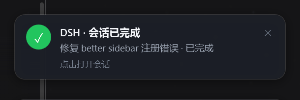

# dsh-session-alert —— 会话任务完成提醒（DSH 客户端插件）

一句话：会话跑完任务时，在**左侧会话侧边栏底部弹卡片** + **屏幕顶部细横幅** +（页面不在前台时）**系统通知**，点一下直达该会话。

## 它做什么

- **触发判定与原生绿点完全一致**：会话运行结束且你当时不在看它（DSH 客户端的 `completionUnread` 事实），所以行为跟侧边栏会话行上那个绿色「已完成」圆点同源，不会误报或漏报。
- **三种提醒同时给出**：
  - 侧边栏底部卡片：常驻，直到你点击跳转、手动关闭，或原生事实被清除（比如你打开了那个会话）；
  - 屏幕顶部细横幅：约 6 秒后自动淡出，可点击、可手动关；
  - 系统通知：页面不在前台时才发（可改配置为 always/off）；点击回到页面并打开该会话。
- **另外两类也覆盖**（你勾选的范围）：
  - 会话**在等你操作**（审批 / 计划确认 / 提问）→ 琥珀色卡片与横幅，且只在该会话不是当前主视图时出现；
  - 会话跑完但**子代理 / 后台任务还在收尾** → 卡片先显示「收尾中 · N 个子代理 / M 个后台任务」，等它们全部结束再发通知；15 分钟兜底（超时也发，并在卡片标注）。
- **不做历史轰炸**：页面刷新、断线重连的第一份快照只用于「播种」，不会补发历史通知。
- **不做设置界面**：所有参数在 `src/client/index.js` 顶部的 `CONFIG`（横幅时长、卡片上限、去抖、收尾超时、系统通知策略、是否聚合子代理/后台任务）。

## 安装 / 更新 / 卸载

前置：本机已装好 `dsh-hot-plugin-host`（在 web profile 的 bundles 里），并且 `dsh web` 正在运行。

```powershell
git clone https://github.com/ZhaoAndy821/dsh-session-alert.git
cd dsh-session-alert

node scripts/push.mjs            # 构建 + 推送到热目录 + 打印宿主状态
node scripts/push.mjs --status    # 只看宿主状态（不改任何东西）
node scripts/push.mjs --rm        # 卸载：删除热目录里的 bundle（打开着的页面约 1.5s 内卸载）
```

- 产物只有一个文件：`~/.dsh/hot-plugins/dsh-session-alert/client.js`；不写 DSH 安装目录、不改 profile、不写 localStorage、不写会话数据。
- 推送后**新打开的页面**会自动挂上；已经打开的页面按下面「已修复的上游缺陷」的说明处理。

## 桌面提醒（原生弹窗 / Windows 通知）

页面内的卡片与横幅只能在浏览器里显示。要让提醒**盖在整个桌面上**（DSH 窗口不在前台时也看得见、不依赖浏览器通知权限），需要第二半：本机回环服务 `desktop/`（`dsh-desktop-alert`）。

```powershell
cd dsh-session-alert
node desktop/cli.mjs install            # 复制到 ~/.dsh/desktop-alert
node desktop/cli.mjs start              # 后台启动桥接服务（127.0.0.1:41411）
node desktop/cli.mjs install-autostart  # 可选：登录自启（开始菜单「启动」快捷方式）
node desktop/cli.mjs test               # 立刻弹一张测试卡片
node desktop/cli.mjs status / logs      # 看状态 / 看日志
```

- **弹窗卡片（默认 `card`）**：无边框、置顶、不抢焦点，出现在主屏右下角，9 秒自动淡出，鼠标悬停时暂停；点一下 → 已经打开的 DSH 标签页**原地跳到该会话**（不再新开窗口），同时把浏览器窗口提到前台。只有「没有任何页面连着」时才退回打开页面 URL。
- **Windows 通知（`--surface toast`）**：以 AUMID `com.deepseek.dsh` 发出真正的系统通知，署名即 **DeepSeek Harness**（带应用图标），并留在操作中心；脚本发出的 toast 拿不到点击回调，所以它不能跳转。
- 只在页面不在前台时弹（与 Z-Code WorkBuddy 的 `mainWindow.isFocused()` 判定同构）；服务没起来时，侧边栏卡片区会显示一行「桌面提醒服务未启动」。
- 设计、接口与取舍（含从 WorkBuddy `main/index.js` 的 `showTaskNotification` 学到什么）见 [`desktop/README.md`](desktop/README.md)。



_置顶卡片实录：不出现在任务栏、不抢焦点，9 秒后自动淡出；点一下 → 已打开的 DSH 标签页原地跳到该会话（不再新开窗口）。_


## 测试

```powershell
node scripts/build.mjs && node test/smoke.mjs   # 纯逻辑：10 项投射/边沿/收尾断言，不需要浏览器
node test/browser-check.mjs                     # 真页面结构校验：插件是否真的挂上、有没有报错
node test/browser-check.mjs --stage             # 端到端：发一条测试提示词 → 切走 → 等提醒出现 → 点卡片
node test/desktop-alert.mjs                     # 11 项：bundle 沙箱内跑通 → 探活 → 完成即 POST /notify → 点击即 openSession + /ack
node test/bridge.mjs                            # 14 项：私有端口起真桥接、SSE、卡片进程、点击扇出、跨源拦截
```

`browser-check.mjs` 会用本机 profile 的凭证文件（`~/.dsh/.credentials.yaml` 里的 browser-session 密钥）现签一个会话 cookie 给无头 Chromium，所以不需要 token URL，也不会动你正在用的窗口。

## 依赖与已修复的上游缺陷（2026-09-26）

本插件经 `dsh-hot-plugin-host`（本机 fork：`~/.dsh/vendor-plugins/dsh-hot-plugin-host`）加载。使用过程中发现并修复了它**浏览器半边**（`lib/client.js`）的两个缺陷，原文件已备份为同名 `.bak-<时间戳>`：

1. **首次加载被 304 跳过**：宿主路由只要 `If-None-Match` 命中就等于回 304，而浏览器半边无条件带上该头；于是任何新页面（或推送后的旧页面）都拿到 304，被当成「本页已挂载」直接跳过 —— bundle 永远不会真正加载。修复：只有本页确实挂过该版本时才发条件请求；没有已挂版本却收到 304 时补一次无条件请求。
2. **并发挂载重复执行**：启动时 `/hot-plugins/list` 对账与 SSE 快照会同时触发同一 bundle 的加载，脚本执行两次会触发 `client-modules: duplicate factory registration`。修复：按 id 做 in-flight 去重，并发调用共享同一次挂载。

两个修复都只改浏览器半边。DSH 按内容哈希重新发布客户端 bundle，所以**刷新页面即可生效，不需要重启 dsh web**；刷新一次之后，后续 `push` 都能热更新到打开着的页面。

## 已知限制

- 同一个 GUI 开多个标签页会各弹一条系统通知（页面内卡片不受影响）。
- 窄栏（56px rail）未读角标、提示音未实现。
- 只用 DSH 客户端公开事实：`uiSession.sessionStatus`、`sessions.list.byId[].retainedBy.mainView`、`uiWorkspace.openSession`、可选的 `jobs` 服务；DSH 升级后请重跑 `test/smoke.mjs` 与 `test/browser-check.mjs` 回归。
- 旧的、曾用已删除 provider 的会话仍会显示它们当时选的模型（那是会话自身的历史），需要在该会话里重新选一次模型。

## 仓库结构

```
src/client/index.js       插件源码（factory body；只改这里）
scripts/build.mjs         包壳 → lib/client.js（window.__ModuleLoader__.load）
scripts/push.mjs          构建 + 推送到热目录 + 查询宿主状态
test/smoke.mjs            纯逻辑冒烟（不需要浏览器）
test/browser-check.mjs    真页面校验（--stage 为端到端）
test/desktop-alert.mjs    桌面提醒客户端半边：bundle 级测试（沙箱，无需浏览器）
test/bridge.mjs           桌面提醒桥接服务：集成测试（私有端口 + 真卡片进程）
desktop/bridge.mjs        桥接服务（回环 HTTP + SSE，Node 无依赖）
desktop/present.ps1       原生置顶卡片（WPF，ASCII-only）
desktop/toast.ps1         Windows 通知（WinRT，AUMID com.deepseek.dsh）
desktop/cli.mjs           install / start / stop / status / test / logs / autostart
desktop/README.md         桌面提醒的设计、接口、排错
docs/VERIFY.md            人工验收清单
```

## 配置速查（src/client/index.js → CONFIG）

| 键 | 默认 | 含义 |
| --- | --- | --- |
| `bannerMs` | 6000 | 顶部横幅存活时长（ms） |
| `bannerMax` | 3 | 同时最多几条横幅 |
| `cardMax` | 4 | 侧边栏最多几张卡片（其余折成「另有 N 条」） |
| `debounceMs` | 1500 | 运行结束后多久算「完成」（期间又开始跑就取消） |
| `settleTimeoutMs` | 900000 | 等子代理/后台任务的兜底上限（ms） |
| `systemNotification` | `unfocused` | 系统通知策略：`unfocused` / `always` / `off` |
| `systemNotificationKinds` | `[completed, waiting]` | 哪些提醒也发系统通知 |
| `aggregateChildren` | true | 子代理未结束就显示「收尾中」并推迟通知 |
| `aggregateJobs` | true | 后台任务同理（需要 `jobs` 服务） |
| `tickMs` | 5000 | 重新求值周期（刷新相对时间、执行收尾兜底） |
| `desktopAlert` | true | 是否启用原生桌面提醒（需要桥接服务在跑） |
| `desktopAlertWhen` | `unfocused` | 桌面卡片策略：`unfocused` / `always` / `off` |
| `desktopAlertKinds` | `[completed, waiting]` | 哪些提醒也弹桌面卡片 |
| `desktopAlertPorts` | `[41411,41412,41413]` | 探活端口顺序（与桥接服务一致） |
| `desktopAlertRetryMs` | 30000 | 桥接服务不在时的重探周期（ms） |
| `desktopAlertSurface` | `card` | 桥接面：`card` / `toast` / `both` |
